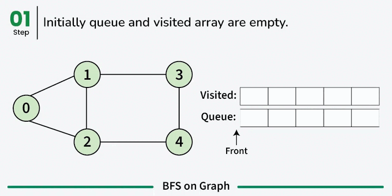
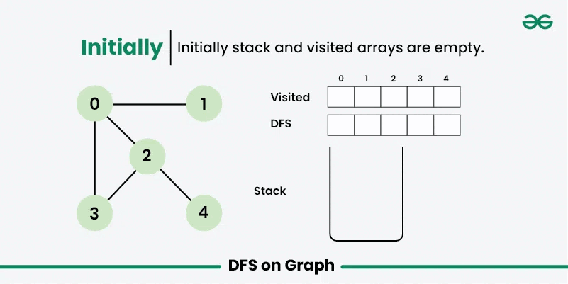
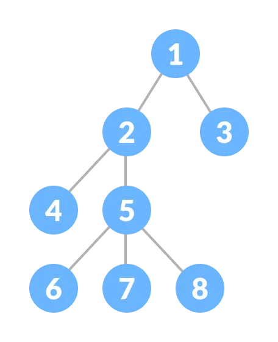
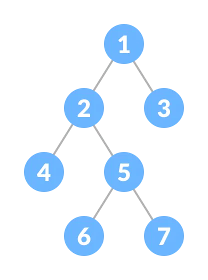
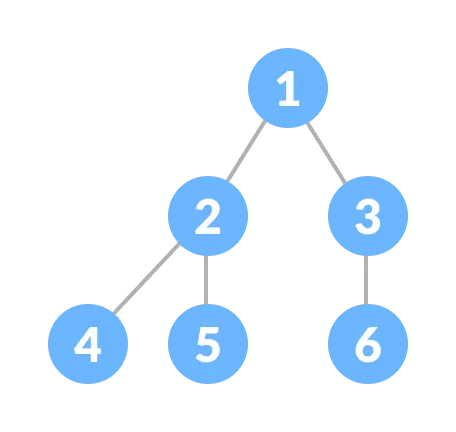
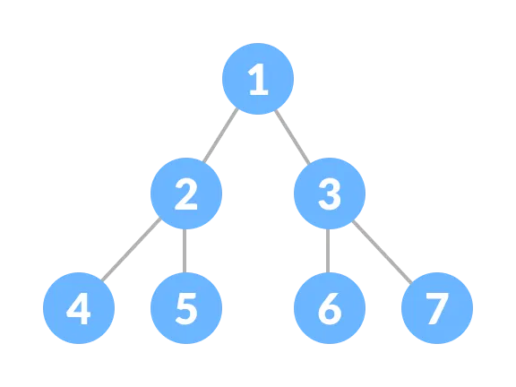
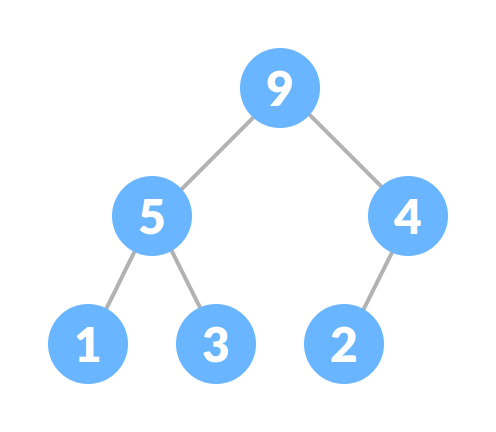

# Algorithm Notes

## 12/18/2025. BFS(Breadth First Search) and DFS(Depth First Search)

### 그래프? Graph?
그래프는 __노드/정점(node, vertex)__ 들과 두 정점을 연결하는 __엣지(edge)__ 들로 구성된 그래프 이론에서 다루는 수학적 대상이다. 연결 방식이나 변의 성질 등에 따라 많은 종류로 나뉜다.

___DFS, BFS 모두 그래프를 탐색하는 방법이다.___

### 너비 우선 탐색(BFS, Breadth First Search)
시작 노드에서 가장 가까운 거리상의 노드들을 전부 탐색한 뒤, 그 다음으로 가까운 거리에 위치한 노드들을 탐색하는 기법. BFS는 __다익스트라알고리즘(Dijkstra's shortest path)__, __위상정렬 알고리즘(Kahn's Algorithm)__ 그리고 __프림 알고리즘(Prim's algorithm)__ 의 기반이 되었다.
BFS는 방향/무방향 그래프 내 순환의 유무, 가중치가 없는 그래프에서의 최단 거리를 찾는 등 많은 문제에서 활용된다.

__BFS는 다음의 단계를 통해 주어진 그래프를 탐색한다:__
1. 주어진 시작 노드의 이웃한 노드들을 큐(queue, 방문해야할 노드들의 대기열)에 기록
2. 현재 노드(탐색이 완료된 노드)를 재탐색하지 않도록 표시(_Mark as visited_).
3. 큐에 기록된 순서대로 이웃된 각 노드들에 대해 단계 1,2의 방법으로 탐색을 진행한다.
4. 그래프의 모든 노드가 표시될때까지 탐색을 진행한다.



```c++
// C++ program for BFS
#include <iostream>
#include <queue>
#include <vector>
using namespace std;

// BFS from given source s
void bfs(vector<vector<int>>& adj, int s)
{
    // Create a queue for BFS
    queue<int> q;

    // Initially mark all the vertices as not visited
    // When we push a vertex into the q, we mark it as
    // visited
    vector<bool> visited(adj.size(), false);

    // Mark the source node as visited and
    // enqueue it
    visited[s] = true;
    q.push(s);

    // Iterate over the queue
    while (!q.empty()) {

        // Dequeue a vertex from queue and print it
        int curr = q.front();
        q.pop();
        cout << curr << " ";

        // Get all adjacent vertices of the dequeued
        // vertex curr If an adjacent has not been
        // visited, mark it visited and enqueue it
        for (int x : adj[curr]) {
            if (!visited[x]) {
                visited[x] = true;
                q.push(x);
            }
        }
    }
}

// Function to add an edge to the graph
void addEdge(vector<vector<int>>& adj,
                          int u, int v)
{
    adj[u].push_back(v);
    adj[v].push_back(u); // Undirected Graph
}

int main()
{
    // Number of vertices in the graph
    int V = 5;

    // Adjacency list representation of the graph
    vector<vector<int>> adj(V);

    // Add edges to the graph
    addEdge(adj, 0, 1);
    addEdge(adj, 0, 2);
    addEdge(adj, 1, 3);
    addEdge(adj, 1, 4);
    addEdge(adj, 2, 4);

    // Perform BFS traversal starting from vertex 0
    cout << "BFS starting from 0 : \n";
    bfs(adj, 0);

    return 0;
}
```

---

### 깊이 우선 탐색(DFS, Depth First Search)
BFS와 다르게, 이웃 노드를 탐색할 때, 탐색할 타겟 노드를 통해 접근할 수 있는 모든 노드를 먼저 탐색한 후 다음 이웃 노드를 탐색한다. 모든 노드를 탐색할 필요성이 있거나 출발점 노드에서 목적지 노드까지의 경로 존재 유무를 파악할 때 이용된다.

__DFS는 다음의 단계를 통해 주어진 그래프를 탐색한다:__
1. 현재(또는 시작) 노드를 탐색 후 재탐색하지 않도록 표시(_Mark as visited_).
2. 인접 노드가 있다면 해당 노드로 이동후 탐색 후 방문완료 표시
3. 1~2 단계를 인접 노드가 더 이상 없을 때까지 탐색.
4. 더 이상 갈 곳이 없다면 백트래킹
    - 이때 스택 자료구조를 활용하여 탐색할 노드를 추적한다.
6. 그래프의 모든 노드가 표시(탐색 완료)될때까지 탐색을 진행한다.


```c++
// C++ program for DFS
#include <bits/stdc++.h>
using namespace std;

// Recursive function for DFS traversal
void DFSRec(vector<vector<int>> &adj, vector<bool> &visited, int s){

    visited[s] = true;

    // Print the current vertex
    cout << s << " ";

    // Recursively visit all adjacent vertices
    // that are not visited yet
    for (int i : adj[s])
        if (visited[i] == false)
            DFSRec(adj, visited, i);
}

// Main DFS function that initializes the visited array
// and call DFSRec
void DFS(vector<vector<int>> &adj, int s){
    vector<bool> visited(adj.size(), false);
    DFSRec(adj, visited, s);
}

// To add an edge in an undirected graph
void addEdge(vector<vector<int>> &adj, int s, int t){
    adj[s].push_back(t);
    adj[t].push_back(s);
}

int main(){
    int V = 5;
    vector<vector<int>> adj(V);

    // Add edges
    vector<vector<int>> edges={{1, 2},{1, 0},{2, 0},{2, 3},{2, 4}};
    for (auto &e : edges)
        addEdge(adj, e[0], e[1]);

    int s = 1; // Starting vertex for DFS
    cout << "DFS from source: " << s << endl;
    DFS(adj, s); // Perform DFS starting from the source vertex

    return 0;
}
```
---

### DFS VS BFS


| 특성             | DFS                                      | BFS                                      |
|------------------|------------------------------------------|------------------------------------------|
| **탐색 방식**    | 한 경로를 끝까지 탐색                    | 가까운 노드부터 탐색                     |
| **구현 자료구조**| 스택 또는 재귀 함수                      | 큐                                       |
| **메모리 사용량**| 일반적으로 적음                          | 노드 수에 따라 많아질 수 있음            |
| **최단 경로 탐색**| 보장하지 않음                            | 가중치 없는 그래프에서 최단 경로 보장     |
| **무한 루프 위험**| 방문 체크 없을 시 발생 가능              | 일반적으로 발생하지 않음                 |
| **적용 분야**    | 모든 경로 탐색, 경로 특징 저장 필요 시   | 최단 경로 탐색, 미로 찾기 등             |


___Reference___
- Wikipedia: Graph theory [[Link](https://en.wikipedia.org/wiki/Graph_theory)]
- geeksforgeeks: Breadth First Search or BFS for a Graph [[Link](https://www.geeksforgeeks.org/breadth-first-search-or-bfs-for-a-graph/)]
- geeksforgeeks: Depth First Search or DFS for a Graph [[Link](https://www.geeksforgeeks.org/depth-first-search-or-dfs-for-a-graph/)]


---

## 12/16/2025. Heap data structure and max/min heap
### 힙? Heap?
힙 자료구조는 __힙의 속성(heap property)__ 을 만족하는 __완전 이진 트리(complete binary tree)__ 이다.
#### 완전? 이진? 트리? Complete? binary? tree?
_먼저, 트리 자료구조부터 알아보자_
#### 트리 자료구조 Tree data structure

트리는 `노드(nodes)`와 `간선(edges)`로 연결된 비선형 계층적 자료구조이다. 모든 트리는 `루트 노드(Root node)`에서 시작되며, `부모(Parent) 노드`와 `자식(Child) 노드`가 존재한다. `Tree`는 `Graph`의 특수한 형태 중 하나이며, 둘의 구조상 차이는 다음과 같다

| **특징**               | **Tree (트리)**                        | **Graph (그래프)**                       |
|-----------------------|--------------------------------------|----------------------------------------|
| **루트 노드**         | 반드시 존재하며, 단 하나의 루트 노드만 가질 수 있음 | 루트 노드가 없으며 임의의 노드에서 시작 가능 |
| **계층 구조**         | 계층적 구조 (Hierarchical)             | 계층 구조를 가질 필요가 없음             |
| **사이클 (Cycle)**    | **사이클이 없음 (Acyclic)**            | 사이클이 있을 수도 있고 없을 수도 있음     |
| **간선 (Edges)**      | 각 노드 간의 연결은 부모-자식 관계를 따름 | 노드 간의 연결 관계에 제한이 없음          |
| **연결성**            | 모든 노드가 하나의 연결된 구성 요소임     | 연결되지 않은 구성 요소도 있을 수 있음      |

#### 이진 트리와 그 종류들 Binary tree and its types
이진 트리 자료구조는 부모 노드가 최대 2개의 자식 노드만을 가질 수 있는 트리 자료 구조이다. 이진 트리는 여러 속성과 규칙 하에 다양한 유형으로 분류될 수 있다.
- __Full__: 모든 노드에 2개 또는 0개의 자식 노드가 있는 형태의 트리

- __Complete__: 마지막 계층을 제외한 모든 계층이 완전한(2개의 자식 노드)이고, 마지막 계층의 노드들은 왼쪽에서 오른쪽으로 채워지는 형태의 트리

- __Perfect__: 마지막 계층을 제외한 모든 계층이 꽉 찬 상태(2개의 자식 노드)이고 최하층의 노드들이 모두 같은 계층에 위치한 형태의 트리


### 힙 자료구조 Heap Data structure
다시 한번 힙에 대한 정의를 보자, 힙 자료구조는 __힙의 속성(heap property)__ 을 만족하는 __완전 이진 트리(complete binary tree)__ 이다. 여기서 힙의 속성은 모든 노드에 대해 동일하게 적용된다.
- __최대 힙 속성 max heap property__: 본인 노드에 저장된 데이터값이 자식 노드보다 항상 크다. 즉 `root node`에 저장된 값은 다른 모든 노드의 값보다 더 큰 값을 가지고 있다.

- __최소 힙 속성 min heap property__: 본인 노드에 저장된 데이터값이 자식 노드보다 항상 작다. 즉 `root node`에 저장된 값은 다른 모든 노드의 값보다 더 작은 값을 가지고 있다.


#### 힙 자료구조의 활용처
- __힙 정렬__: 제한적인 메모리 공간에서 일정한 성능을 보여줌 `O(nlogn)`
- __그래프 알고리즘__: Prim, 다익스트라 알고리즘 등 많은 곳에서 활용됨
- __우선순위 큐__: 큐 자료구조의 변형, 우선순위가 높은 요소가 먼저 처리되는 특징을 가진다.

___Reference___
- Wikipedia: Heap (data structure) [[Link](https://en.wikipedia.org/wiki/Heap_(data_structure))]
- Programiz: Heap Data Structure [[Link](https://www.programiz.com/dsa/heap-data-structure)]
- Programiz: Tree Data Structure [[Link](https://www.programiz.com/dsa/trees)]
- Programiz: Binary Tree [[Link](https://www.programiz.com/dsa/binary-tree)]
